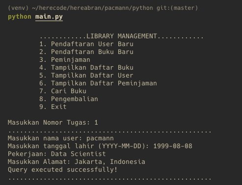
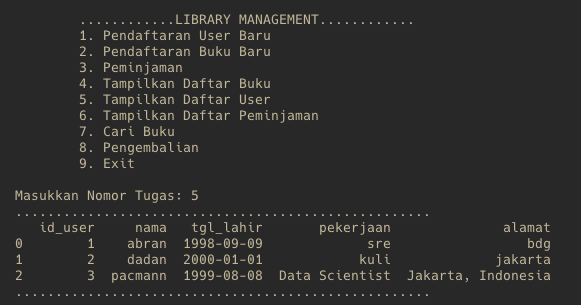
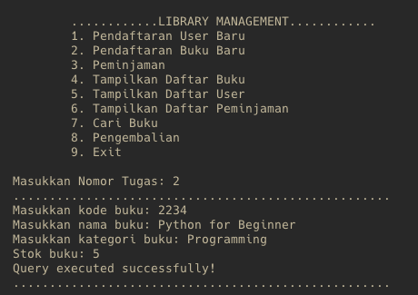
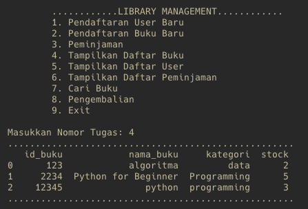
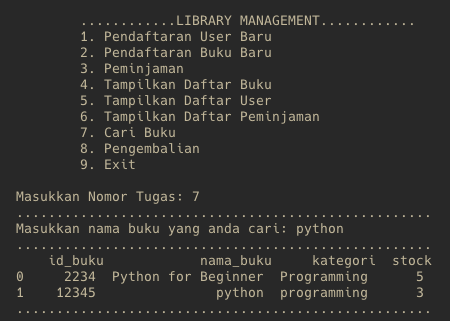
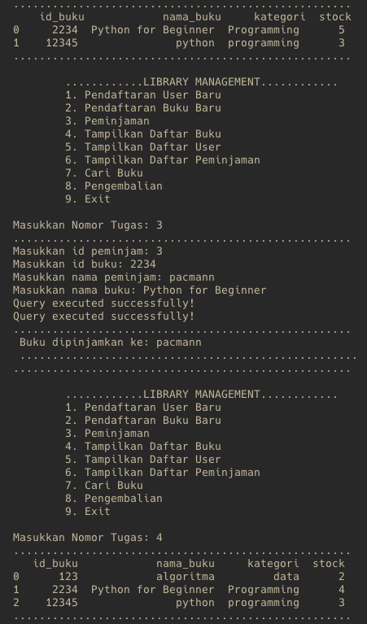
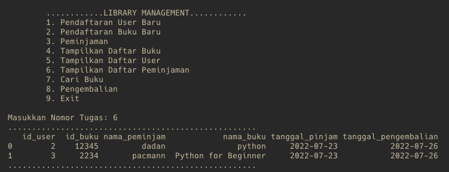
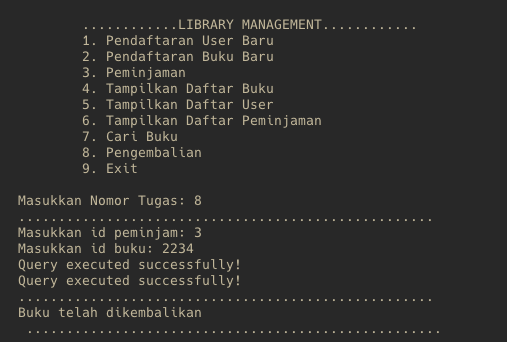
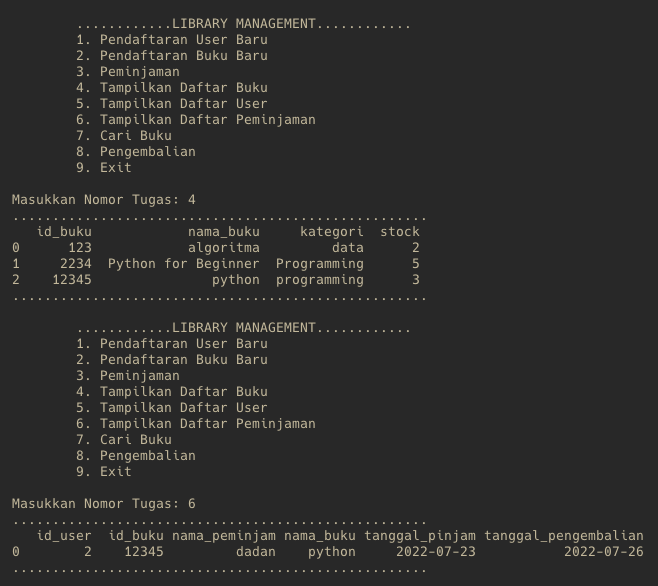
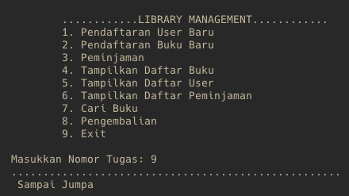

### Tujuan Pengerjaan
>Untuk memenuhi Tugas 4 Python Programming Pacmann non-degree program BI Batch 9

## Deskripsi Tasks
#### 1. 

#### 2. 

#### 3. 

#### 4. 

#### 5. 

## How to run the program
#### `Prerequisites: Place the sample Data`
**NOTE:**
Read the docs [here](data/README.md).
#### 1. 

*Result:*

#### 2. 

#### 3. 

## Hasil Test Case
#### 1. Pendaftaran User
  - **Menginputkan Data**
  * 
  - **Menampilkan Data User Setelah Insert**
  * 
#### 2. Pendaftaran Buku
  - **Menginputkan Buku**
  * 
  - **Menampilkan Daftar Buku**
  * 
  - **Mencari nama buku dengan keyword**
  * 
#### 3. Peminjaman
  - **Menginputkan Data Peminjaman dan Menampilkan Data Buku Setelah Dilakukan Peminjaman (Stock Berkurang)**
  * 
  - **Menampilkan Data Peminjaman**
  * 
#### 4. Pengembalian
  - **Menginputkan Data Pengembalian**
  * 
  - **Menampilkan Data Buku Setelah Pengembalian (Stock terupdate) dan Menampilkan Data Peminjaman Setelah Pengembalian (Data di Peminjaman Terhapus)**
  * 
#### 5. Exit
  * 

### Saran Perbaikan
>Placeholder
